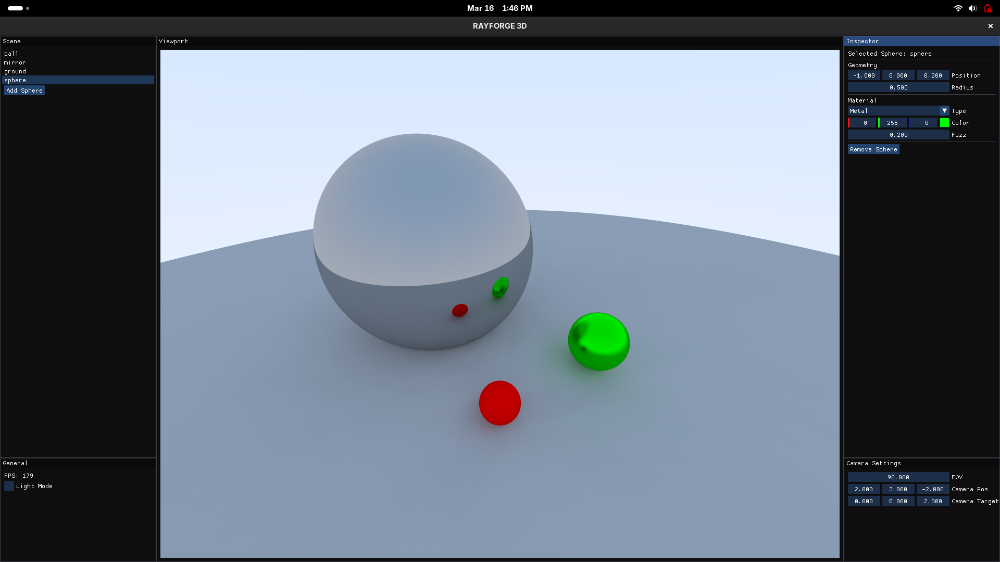

# RAYFORGE 3D

## Usage:
### Scene:
Add new objects and name them on the scene panel.
### Inspector:
Edit your objects, move them, color them...
### General:
Switch to light mode and see your FPS.
### Camera Settings:
Position your camera to have crazy renders.

This raytracer runs on linux